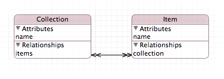
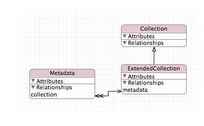

# Model Extension

## Requirements

## Installation

ModelExtension is available through [CocoaPods](http://cocoapods.org). To install
it, simply add the following line to your Podfile:

    pod "ModelExtension"

## Usage

Start by defining you base model.

An extension model will be created in the same manner as a _normal_ model. Add the entites you want to use. If you want to build an subentity of an entity defined in the base model, you have to create an abstract entity with the same name. This abstract entity must not have any properties.

In this example the base model defines a _Collection_ and _Item_. The extension model extends the _Collection_ with a custom subentity haveing a reference to _Metadata_.

    // Get the base model and the extension
	NSManagedObjectModel *baseModel = …
    NSManagedObjectModel *modelExtension = …
	
	// Create an extended model
	NSManagedObjectModel *extendedModel = [baseModel modelByExtendingWithModels:@[modelExtension]];

## Author

Tobias Kräntzer, info@tobias-kraentzer.de

## License

Copyright (c) 2014, Tobais Kräntzer
All rights reserved.

Redistribution and use in source and binary forms, with or without modification, are permitted provided that the following conditions are met:

1. Redistributions of source code must retain the above copyright notice, this list of conditions and the following disclaimer.

2. Redistributions in binary form must reproduce the above copyright notice, this list of conditions and the following disclaimer in the documentation and/or other materials provided with the distribution.

3. Neither the name of the copyright holder nor the names of its contributors may be used to endorse or promote products derived from this software without specific prior written permission.

THIS SOFTWARE IS PROVIDED BY THE COPYRIGHT HOLDERS AND CONTRIBUTORS "AS IS" AND ANY EXPRESS OR IMPLIED WARRANTIES, INCLUDING, BUT NOT LIMITED TO, THE IMPLIED WARRANTIES OF MERCHANTABILITY AND FITNESS FOR A PARTICULAR PURPOSE ARE DISCLAIMED. IN NO EVENT SHALL THE COPYRIGHT HOLDER OR CONTRIBUTORS BE LIABLE FOR ANY DIRECT, INDIRECT, INCIDENTAL, SPECIAL, EXEMPLARY, OR CONSEQUENTIAL DAMAGES (INCLUDING, BUT NOT LIMITED TO, PROCUREMENT OF SUBSTITUTE GOODS OR SERVICES; LOSS OF USE, DATA, OR PROFITS; OR BUSINESS INTERRUPTION) HOWEVER CAUSED AND ON ANY THEORY OF LIABILITY, WHETHER IN CONTRACT, STRICT LIABILITY, OR TORT (INCLUDING NEGLIGENCE OR OTHERWISE) ARISING IN ANY WAY OUT OF THE USE OF THIS SOFTWARE, EVEN IF ADVISED OF THE POSSIBILITY OF SUCH DAMAGE.