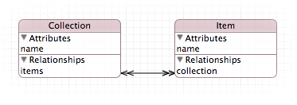
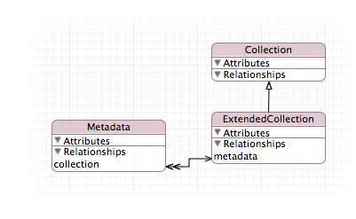

# Model Extension

`ModelExtension` provides a category on `NSManagedObjectModel` to support extending a model defined in one file by a model defined in an other file.

## Requirements

`ModelExtension` has no requirements beside the obvious requirement of `CoreData`.

## Installation

`ModelExtension` is available through [CocoaPods](http://cocoapods.org). To install
it, simply add the following line to your Podfile:

    pod "ModelExtension"

## Usage

An extended model is created by calling the method `-[NSManagedObjectModel modelByExtendingWithModels:]` on the base model with an array of the sub models. This method returns a new combined model.

    // Get the base model and the extension
	NSManagedObjectModel *model = …
    NSManagedObjectModel *subModel = …
	
	// Create an extended model
	NSManagedObjectModel *extendedModel = [model modelByExtendingWithModels:@[subModel]];

The extension is done by replacing an abstract entity in the sub model by its concrete entity in the base model. To extend an entity in a base model, an abstract entity with the same name has to be created in the sub model. This abstract entity must not have any properties.

The example below shows a model with the entities _Collection_ and _Item_ …

… and a sub model with the entity _ExtendedCollection_ wich should be a sub entity of Collection.

Calling `-[NSManagedObjectModel modelByExtendingWithModels:]` will return a model, that sets the entity _Collection_ of the base model as the super entity of the entity _ExtendedCollection_ of the sub model.

## Author

Tobias Kräntzer, info@tobias-kraentzer.de

## License

Copyright (c) 2014, Tobias Kräntzer
All rights reserved.

Redistribution and use in source and binary forms, with or without modification, are permitted provided that the following conditions are met:

1. Redistributions of source code must retain the above copyright notice, this list of conditions and the following disclaimer.

2. Redistributions in binary form must reproduce the above copyright notice, this list of conditions and the following disclaimer in the documentation and/or other materials provided with the distribution.

3. Neither the name of the copyright holder nor the names of its contributors may be used to endorse or promote products derived from this software without specific prior written permission.

THIS SOFTWARE IS PROVIDED BY THE COPYRIGHT HOLDERS AND CONTRIBUTORS "AS IS" AND ANY EXPRESS OR IMPLIED WARRANTIES, INCLUDING, BUT NOT LIMITED TO, THE IMPLIED WARRANTIES OF MERCHANTABILITY AND FITNESS FOR A PARTICULAR PURPOSE ARE DISCLAIMED. IN NO EVENT SHALL THE COPYRIGHT HOLDER OR CONTRIBUTORS BE LIABLE FOR ANY DIRECT, INDIRECT, INCIDENTAL, SPECIAL, EXEMPLARY, OR CONSEQUENTIAL DAMAGES (INCLUDING, BUT NOT LIMITED TO, PROCUREMENT OF SUBSTITUTE GOODS OR SERVICES; LOSS OF USE, DATA, OR PROFITS; OR BUSINESS INTERRUPTION) HOWEVER CAUSED AND ON ANY THEORY OF LIABILITY, WHETHER IN CONTRACT, STRICT LIABILITY, OR TORT (INCLUDING NEGLIGENCE OR OTHERWISE) ARISING IN ANY WAY OUT OF THE USE OF THIS SOFTWARE, EVEN IF ADVISED OF THE POSSIBILITY OF SUCH DAMAGE.